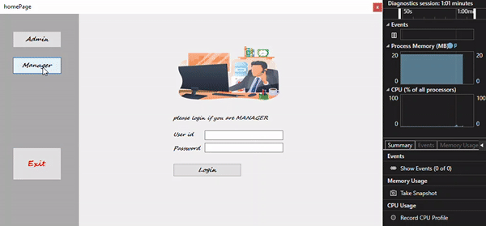
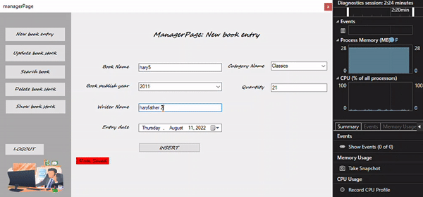

# library_management_system
its a library book management system, where we have two kind of user 
1. Admin
2. Manager

duty of Admin
- Admin's only duty is to give access to certain people using user id and a passcode, which he needs to add into the database via this app.
  [ Admin will create and delete Managers ]

duty of manager
- Manager can Add New Books
- Manager can update current books stock
- Manager can search book stock
- Manager can delete Books

##sample of app 
 
Admin Interface
 

 
Manager Interface 1: login, New book add operation
 

 
Manager Interface 2: delete operatoin, search operation
 

